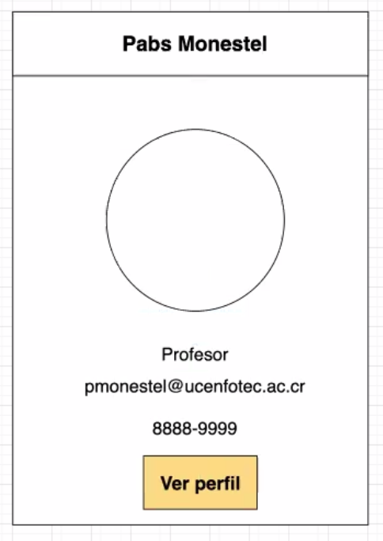

profesor: Pablo Monestel
clase: proyecto_1
semana: 2
fecha: 22-5-2020
---

## Formato visual

La forma en la cual se acomodan los elementos dentro del html

### Display

- block: uno abajo del otro: div, li, ul, p, nav
- inline: uno al lado del otro: span, a, input, label, img, output, select

#### Elementos en bloque (block)

- Por defecto ocupan el 100% del ancho de la página
- No perminte que se coloquen otros elementos a la par ( de forma natural)
- El tamaño del elemento en bloque se puede definir por medio de las propiedades width y height
- Adicionalmente el tamaño anterior, se le debe sumar lo que mida el borde y el padding, pero se recomienda usar box-sizing: border box

#### Elementos en linea (inline)

- Por defecto su tamaño depende del contenido que tiene dentro
- Darle valores a su width y height no modifican el tamaño del elemento
- Si se desea modificar las caracteristicas de tamaño se puede modificar su display a inline-block

### Modelo de cajas

Todo elemento de html se compone de un conjunto de cajas:
- contenido
- padding: espacio existente entre el borde y el contenido
- border: la linea que envuelve un elemento
- margin: la separacion entre en elemento y otro

### Ejercicio #1
Hacer un card que sea igual al siguiente:
<!--  -->

